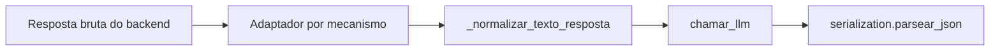

# Contrato de Resposta LLM

Fronteira entre resposta bruta do backend e texto que o pipeline consome. Complementa [llm-provider-strategy.md](llm-provider-strategy.md).

## Fluxo



## API pública

```python
async def chamar_llm(prompt_completo, system_prompt=PROMPT_SISTEMA) -> str | None
```

- **Sucesso:** `str` não vazio (texto do assistente, em geral JSON ou markdown com JSON).
- **Falha total:** `None` (sem credencial, erro, resposta vazia, whitespace só).
- O pipeline **não** sabe qual provider ou mecanismo foi usado.

## Normalização (`_normalizar_texto_resposta`)

| Entrada | Saída |
|---------|-------|
| `None` | `None` |
| não-`str` | `None` + aviso no log |
| `""` ou só whitespace | `None` |
| texto válido | `strip()`; `\r\n` → `\n` |

**Não remove** fences markdown (` ``` `). Isso é responsabilidade de `parsear_json` em `serialization.py`.

Exemplo: entrada `  \n```json\n{}\n```\n  ` → saída ` ```json\n{}\n``` ` (fence preservada; só whitespace externo removido).

## Adaptadores (raw → texto)

| Função | Mecanismo | Entrada |
|--------|-----------|---------|
| `_texto_de_resposta_anthropic_api` | `anthropic/api` | objeto `messages.create` |
| `_texto_de_resposta_anthropic_sdk` | `anthropic/agent_sdk` | `str` acumulada do stream |
| `_texto_de_resposta_anthropic_cli` | `anthropic/cli` | `stdout` do subprocess |
| `_texto_de_resposta_openai_api` | `openai/api` | objeto `chat.completions.create` |

Todos terminam em `_normalizar_texto_resposta`.

### OpenAI (`_texto_de_resposta_openai_api`)

Extrai `choices[0].message.content` e tolera:

- `choices` vazio → `None`
- `message` ou `content` ausente → `None`
- `content` como `str` → normalizado
- `content` como lista de partes (`type: text`) → join e normalizado

## Erros

- **Retry de rate limit:** dentro de `chamar_claude_api` e `chamar_openai_api` (mesmas constantes de `config.py`).
- **`_tentar_mecanismo`:** trata resultado final ou exceção final; não duplica retry.
- **Exceções não vazam** de `_cadeia_*` nem de `chamar_llm`.
- **`_classificar_erro`:** padroniza mensagem de log (`recuperavel` prepara terreno; decisão de retry continua na API).

Log de falha: `! <provider>/<mechanism> falhou (<mensagem>)`

## Pipeline

```python
resposta = await chamar_llm(prompt)
if not resposta:
    # falha total
dados = parsear_json(resposta)
```

Nenhuma alteração necessária em `pipeline.py` quando novos providers forem adicionados, desde que respeitem este contrato.
